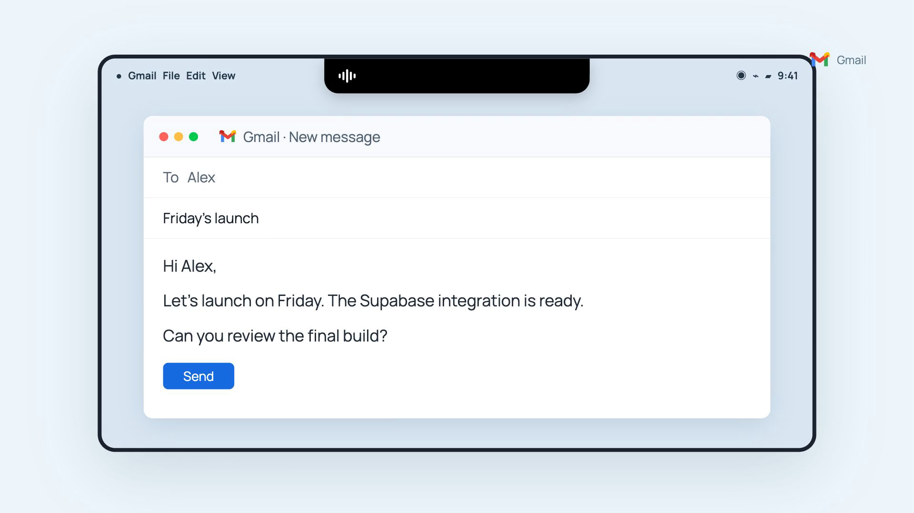
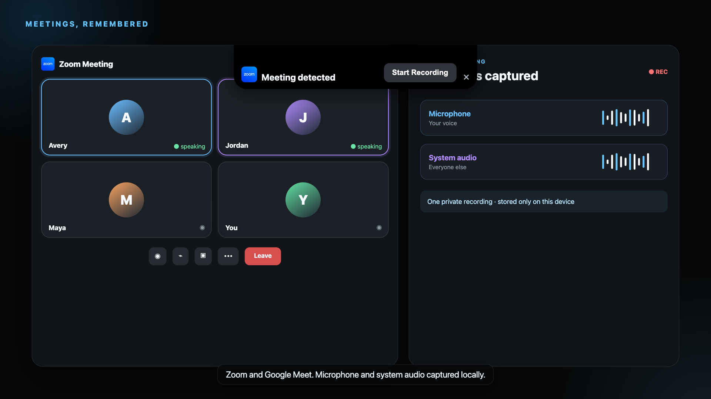

<p align="center">
  
</p>

<h1 align="center">YapFlow</h1>

<p align="center"><strong>Don't type. Just talk. 100% local.</strong></p>

<p align="center">
  A free, open-source voice workspace for macOS and Windows.<br>
  Dictate into any app, capture meetings, and keep every word on your device.
</p>

<p align="center">
  <a href="https://yapflow.app">Website</a> ·
  <a href="https://yapflow.app/downloads/YapFlow_0.2.8_aarch64.dmg">Download for Mac</a> ·
  <a href="https://yapflow.app/downloads/YapFlow_0.2.8_x64-setup.exe">Download for Windows</a> ·
  <a href="https://github.com/automatewithmarko/yapflow/issues">Report an issue</a>
</p>

<p align="center">
  <a href="LICENSE"></a>
  
  
  
</p>

## See YapFlow in action

https://github.com/user-attachments/assets/bb18000b-fce2-48fa-9a5d-38d2e0b57449

## Your voice stays yours

YapFlow turns speech into polished text without sending recordings, transcripts, vocabulary, or history to a cloud transcription service. Hold a shortcut, speak naturally, and release to type into the app you are already using.

- **Local transcription** with multilingual Whisper
- **Works everywhere** through global keyboard and extra mouse-button shortcuts
- **Intelligent cleanup** for filler words, corrections, punctuation, and formatting
- **Custom vocabulary** for names, brands, and specialist terms
- **Meeting capture** for active Zoom and Google Meet sessions
- **Microphone + system audio** recorded locally
- **Speech and meeting history** stored on your device
- **Native notch and pill** experience for macOS and Windows

<table>
  <tr>
    <td width="50%"></td>
    <td width="50%"></td>
  </tr>
  <tr>
    <td align="center"><strong>Speak into any app</strong></td>
    <td align="center"><strong>Capture meetings locally</strong></td>
  </tr>
</table>

Visuals above are illustrative frames from the launch film. The reproducible video source and asset notes are in [demo-video](demo-video/README.md).

## How it works

```text
Your microphone ──> local Whisper model ──> cleanup + vocabulary ──> active app
Meeting audio ────> local microphone + system-audio recording ─────> history
```

The only expected network access is for downloading local models, checking for signed official updates, and downloading an update you choose to install.

## Get YapFlow

The fastest route is the signed installer from [yapflow.app](https://yapflow.app). The setup wizard checks the operating system's real permission state, requests only missing access, downloads the transcription model, and helps configure shortcuts.

### Build from source

Requirements: Node.js 22+, Rust stable, and the [Tauri 2 prerequisites](https://v2.tauri.app/start/prerequisites/) for your platform.

```bash
git clone https://github.com/automatewithmarko/yapflow.git
cd yapflow
npm install
npm run desktop:dev
```

Useful checks:

```bash
npm run build
node --experimental-strip-types --test tests/*.test.mjs
cargo test --manifest-path src-tauri/Cargo.toml --lib
```

Official macOS releases require an Apple Developer ID certificate and notarization credentials. Official Windows releases are produced by the project maintainers. Local contributors can run and build the app without access to any production credential.

## Safe official updates

Open source does **not** grant access to YapFlow's production systems.

- The repository contains only the **public** updater verification key.
- Official update packages are signed with a **private key stored outside this repository**.
- A modified build cannot create an update accepted by official YapFlow installations.
- GitHub contributors cannot deploy to Railway or publish releases without separate maintainer credentials.
- The public web/update service accepts only `GET` and `HEAD`; it exposes no code-writing endpoint.

Fork maintainers should replace the updater endpoint and public verification key with infrastructure they control. See [the security model](docs/SECURITY_MODEL.md) for the full trust boundary.

## Project layout

| Path | Purpose |
| --- | --- |
| `src/` | React interface and desktop flows |
| `src-tauri/` | Rust native shell, audio, permissions, shortcuts, and updater |
| `server.mjs` | Read-only website, downloads, and signed update metadata |
| `tests/` | Permission, analytics, and version regression tests |
| `demo-video/` | Reproducible Remotion launch video |

## Contributing

Issues and pull requests are welcome. Please read [CONTRIBUTING.md](CONTRIBUTING.md) and report security problems privately as described in [SECURITY.md](SECURITY.md).

## License and brand

The source code is available under the [MIT License](LICENSE). “YapFlow,” its logo, and PowerBrix branding are not granted by that license; see [TRADEMARKS.md](TRADEMARKS.md).

<p align="center">
  Built by <a href="https://powerbrix.ai">PowerBrix</a> ·
  <a href="mailto:contact@thementorprogram.xyz">Support</a>
</p>
